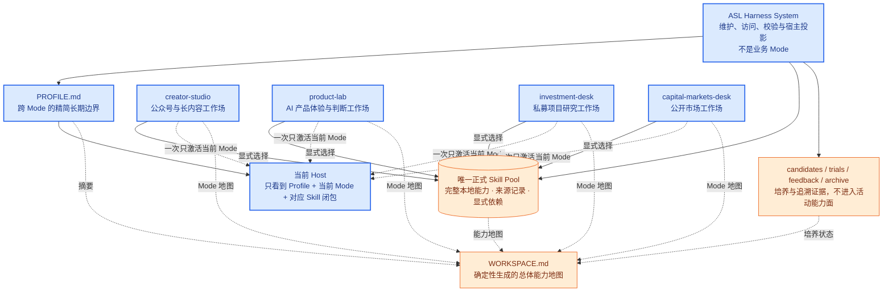
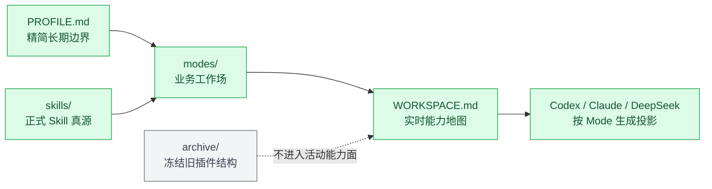

<p align="center">
  
</p>

<h1 align="center">Agent Skill Library</h1>

<p align="center">
  <strong>一套在真实写作、产品分析和投资研究中反复使用、筛选和修改过的个人 AI 工作环境。</strong>
</p>

<p align="center">
  <a href="https://github.com/qihangzhang-272/agent-skill-library/stargazers"></a>
  <a href="https://github.com/qihangzhang-272/asl-harness"></a>
  
</p>

> [!IMPORTANT]
> 这不是一组等待手工拼接的插件，而是一份可以直接交给 ASL Harness 的 Mode-native Environment。正式 Skill 只保留一个活动真源，由业务 Mode 按工作场选择。

## 为什么不是再建一个 Skill 清单

真正的问题不是找不到 Skill，而是找到以后怎么处理：哪些值得留下，哪些只适合一次任务，哪些应该合并进已有能力，以及写作时为什么不应该同时加载投研和资本市场上下文。

Agent Skill Library 把这些取舍保存为一个可以继续维护的 Environment：

- 正式 Skill 是已经本地化的完整能力；
- Mode 选择一种工作状态真正需要的 Skill；
- 用户明确指定的外部能力在完整读取后直接本地化；Candidate 与 Trial 只处理仍然存在的不确定性；
- 来源、版本和本地变化留在 Skill 自己的 `SOURCE.md`；
- 当前 Host 负责工作，ASL Harness 负责让环境不跑偏。

## 和 ASL Harness 的关系

| 项目 | 里面有什么 | 用法 |
| --- | --- | --- |
| [ASL Harness](https://github.com/qihangzhang-272/asl-harness) | 空白框架、校验和三宿主投影 | 从零培养自己的 Environment |
| **Agent Skill Library** | 已经筛选和培养过的业务 Skill 与 Mode | 直接使用，再按自己的工作方式增删 |

这不是“框架仓库 + 技能市场”。Agent Skill Library 本身就是一份装入内容的 ASL Environment；它与空白 Harness 使用同一套目录、同一套约束和同一套宿主接入方式。

## 能力如何组成工作环境



空白 Harness 与装填版 Environment 的复杂总图、运行时序、外部能力生命周期和三宿主投影，统一维护在 [ASL Harness 的架构文档](https://github.com/qihangzhang-272/asl-harness/blob/main/docs/asl-architecture-views.md)。

这不是业务流程图。四个 Mode 是四个广域工作场，它们可以显式选择同一个正式 Skill，但不会互相继承、互相调用，也不会把执行顺序写进 Mode。

Mode 不是固定 Workflow。它不规定“先搜索、再分析、再写作”，只限制当前 Host 能看见哪些正式能力。普通任务在 Goal / Case 循环中完成；能力缺口、Mode 边界变化和宿主投影变化分别进入另外三个独立循环。

## 当前业务 Mode

### Creator Studio

面向公众号和长内容生产，覆盖素材研究、文章编辑、视觉叙事、配图、排版、HTML 和发布准备。它不会加载估值、尽调或资本市场材料。

### Product Lab

面向 AI 产品体验、机制拆解和产品判断。它可以调用研究和信息图能力，但不自动进入公众号发布链。

### Investment Desk

面向私募项目研究，从事实、产品判断、竞争格局和单位经济，延伸到评分、估值、尽调、IC memo 和可视化报告。Skill 之间可以声明完整能力依赖，但 Mode 本身不保存固定执行顺序。

### Capital Markets Desk

面向公开市场、公司覆盖、资本市场材料、估值模型、图表和金融文档质检，与私募项目尽调保持边界。

能力发现、培养、Mode/Skill 增删改查和第二大脑访问不属于第五个业务 Mode。它们是 ASL Harness 对整个 Environment 提供的系统能力。

## 直接使用

先下载空白 Harness 和这份装填版 Environment：

```bash
git clone https://github.com/qihangzhang-272/asl-harness.git
git clone https://github.com/qihangzhang-272/agent-skill-library.git
pip install -e ./asl-harness
```

校验当前能力地图，再把需要的 Mode 投影到正在工作的项目：

```bash
asl-harness workspace.validate \
  --workspace ./agent-skill-library

asl-harness state \
  --workspace ./agent-skill-library

asl-harness host.project \
  --workspace ./agent-skill-library \
  --project /path/to/current-project \
  --mode creator-studio \
  --host-id claude-code
```

把 `host-id` 改成 `codex-app` 或 `deepseek-harness` 即可生成另外两个宿主的项目投影。DeepSeek Agent Preset 使用 Harness 的 `deepseek.preset.export` 单独导出，业务内容仍然只来自这份 Environment。

## Skill 从哪里来

外部 Prompt、MCP、Agent、API、Plugin、模型、脚本或开源仓库不会在任务中途被裸调用。

用户明确说“寻找某个外部技能并融入”时，当前 Host 直接获取并完整读取来源，检查与现有能力的关系，然后吸收、合并、建立依赖、保留变体/Adapter、Clean-room 重构，或作为新的完整正式 Skill 纳入。这个路径不强制 Candidate、Trial、示例或效果测试；如果用户同时指定要在哪个 Mode 使用，就在静态结构校验后直接更新该 Mode。

真正使用了上游文字、代码、脚本、模板或独特资产时保留来源与许可；如果个人仓库只提供了需求和整理思路，则不复制实现，按本地契约和许可清楚的公共基础能力独立重构。

只有来源、许可、安全、重合关系、运行方式或是否采用仍不确定时，才进入 Candidate 或 Trial。公开推荐和仓库关注度帮助发现，但 Host 主动发现的来源不会因此自动采用。

需要 MCP、API、Agent、Plugin 或工具的正式 Skill，可以在自己的 package 内携带 portable 或宿主专用 binding 资产。它们跟随完整 Skill 被同步和投影；真正的安装、登录、权限和激活仍由 Codex、Claude Code 或 DeepSeek Harness 的原生 Adapter 完成。

## 仓库结构



| 区域 | 角色 | 约束 |
| --- | --- | --- |
| `skills/` | 可公开、完整、带来源的正式 Skill | 不再按 Domain 复制发行 |
| `modes/` | Creator、Product、Investment、Capital Markets 等业务工作场 | 只保存 Skill 选择，不保存 Workflow |
| `WORKSPACE.md` | Harness 从当前真源生成的能力地图 | 不手写第二份 Skill Index |
| `archive/` | 旧插件布局、系统 Skill 与历史规则 | 冻结追溯，不参与运行 |
| 三宿主接入 | 同一 Environment 可投影到 Codex、Claude Code 与 DeepSeek | 投影可重建，不成为真源 |

旧 `foundation`、`orchestrator`、`skill-index`、`workspace-core` 与 `plugins/domain-*` 均已退出活动根目录。确定性维护职责由 ASL Harness 提供，业务能力只在 `skills/` 保存。

## 当前目录

```text
agent-skill-library/
├── WORKSPACE.md
├── PROFILE.md
├── skills/
│   └── <skill-id>/
│       ├── SKILL.md
│       ├── SOURCE.md
│       ├── references/
│       ├── scripts/
│       ├── assets/
│       └── bindings/            # 可选宿主接线资产
├── modes/
│   └── <mode-id>/
│       ├── MODE.md
│       └── mode.yaml
├── candidates/
├── trials/
├── feedback/
└── archive/
```

`WORKSPACE.md` 是自动生成的人机共读能力地图，不是第二份手写 Skill Index。Mode 只保存显式 Skill 根；Harness 计算正式依赖闭包。

## 维护边界

- 当前 Host 是唯一执行者，Harness 不接管业务任务。
- Skill 是最小完整能力单位，不拆成运行时碎片。
- Mode 是业务工作状态，不是 Domain、Workflow 或个人能力全集。
- 普通 Case 不自动修改 Skill 或 Mode。
- 只使用用户明确反馈，不从点击、沉默或其他模糊行为推断偏好。
- Candidate、Trial、正式 Skill、Mode、Case 和 Archive 不混用。
- 删除、合并和复用优先于增加脚本、字段、配置和隐藏层。

## 当前阶段

动态数量、迁移状态、三宿主投影版本和验证证据不在本 README 重复维护，统一查看 [ASL Architecture Views · View 9](https://github.com/qihangzhang-272/asl-harness/blob/main/docs/asl-architecture-views.md#view-9--当前状态与迁移图)。
