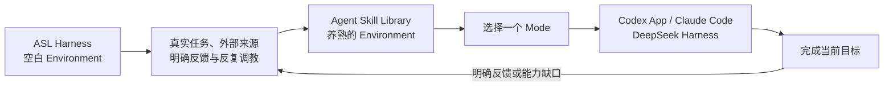
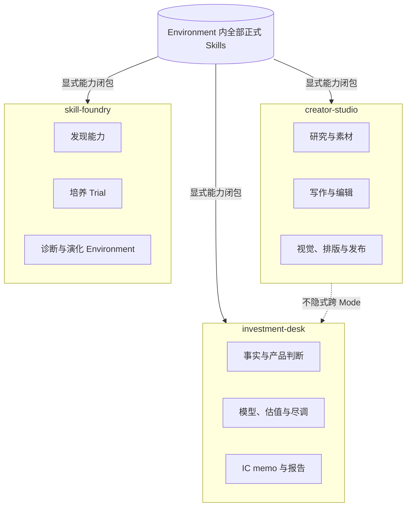

<p align="center">
  
</p>

<p align="center">
  <a href="https://github.com/qihangzhang-272/agent-skill-library/stargazers"></a>
  <a href="https://github.com/qihangzhang-272/asl-harness"></a>
  
  
  
</p>

<p align="center">
  一套已经被真实工作养过、可以继续生长的 ASL Environment。<br />
  Harness 提供空白工作环境；这个仓库装入经过筛选、调教和 Case 验证的 Mode 与 Skill。
</p>

---

## 两个仓库，一种环境

[ASL Harness](https://github.com/qihangzhang-272/asl-harness) 和 Agent Skill Library 不是上下两套系统，也不是“框架加插件市场”。它们遵守同一种 Environment 结构，区别只是里面装了什么。迁移完成后，这个仓库本身就是一个可以直接校验和投影的 ASL Environment。

| 仓库 | 内容 |
| --- | --- |
| `asl-harness` | Harness 实现、空白示例 Environment、宿主投影和确定性校验 |
| `agent-skill-library` | 已经培养过的 Mode、正式 Skill、来源记录和可继续演化的能力环境 |

前者像一间刚交付的工作室：空间、门锁和电路已经装好。后者是使用了很久的工作室：桌上是顺手的工具，墙上有经过验证的方法，每个房间都为一种工作状态准备好了能力。



## Mode，而不是 Domain

Domain 只是在给文件分类；Mode 定义的是 Agent 此刻进入了怎样的工作环境。

一个 Mode 包含完成某类工作所需的本地 Skill、上下文、材料入口、工具边界和交付位置。它不是 Workflow，也不规定“第一步、第二步、第三步”。用户提出目标后，当前 Host 只在这个 Mode 的能力面内选择完整 Skill，并根据材料和任务动态组合。

Mode 的隔离规则很简单：

- 当前 Mode 只能看见自己显式选择的 Skill 及其必要依赖。
- 不会因为另一个 Mode 中有一个看起来顺手的 Skill，就跨过去临时调用。
- 一个 Skill 需要被多个 Mode 共用时，必须由这些 Mode 分别明确选择；共享不是隐式继承。
- 需要另一套工作环境时，切换 Mode，而不是把所有能力永久加载在一起。
- Mode 中的 Skill 列表是能力集合，不是执行顺序。



## 当前 Mode

| Mode | 工作环境 |
| --- | --- |
| `creator-studio` | 公众号、长内容、视觉、排版与发布 |
| `product-lab` | AI 产品体验、机制拆解与产品判断 |
| `investment-desk` | 私募、项目投研、模型、估值、尽调与 IC memo |
| `capital-markets-desk` | 公开市场研究、公司覆盖、图表和投行材料 |
| `second-brain` | 搜集、整理、检索和沉淀个人知识材料 |
| `skill-foundry` | 寻找、培养、合并、诊断和演化能力环境 |

这里没有一个覆盖所有事情的 `personal` Mode。一个人的工作环境由多个 Mode 共同组成，但每次只激活真正需要的那一个。

## 能力是怎么长出来的

Harness 不负责替 Agent 执行业务，也不添加第二个 Agent 循环。当前 Codex、Claude Code 或 DeepSeek Harness 始终是唯一执行者。

原来 `orchestrator` 和 `skill-index` 中有价值的部分，被收敛为 `skill-foundry` Mode 里的维护判断：

```text
当前 Mode 已有合适能力？
├─ 有：直接使用，不搜索
└─ 没有：说清楚缺口
   ├─ 已有 Candidate 或 Trial 能补上：继续培养
   └─ 没有：从可信渠道发现候选
      ├─ 值得测试：进入 Candidate → Trial
      └─ 不值得：记录原因，继续使用现有替代方案

Trial 通过真实 Case，且用户明确采用
└─ 晋升为正式 Skill
   ├─ 只是补强现有能力：合并进原 Skill
   ├─ 是独立能力：保留新 Skill
   └─ 改变一整套长期工作环境：再调整 Mode
```

这不是一个运行时调度器。它不维护隐藏状态、不执行固定链、不在业务任务中途安装能力，也不靠一份巨大的路由脚本控制 Agent。

## 怎么发现值得培养的能力

寻找 Skill 不是在搜索框里输入一个词，然后安装排名第一的结果。真正有价值的线索通常来自两类地方。

### X / Twitter 上的真实使用者

长期使用 Agent 的 KOL 会发布自己刚试过的 Skill、仓库、Prompt、MCP 或工具。带真实任务、截图、踩坑、对比和复盘的推荐，通常比项目自己的宣传更有信息量。

`skill-foundry` 使用 [Agent Reach](https://github.com/Panniantong/Agent-Reach) 读取指定 KOL 的公开时间线、单条推文、长文和讨论，把原帖与使用情境保存为来源证据。转发数、收藏数和 KOL 身份是发现信号，不是采用结论。

### GitHub 上的真实仓库

GitHub stars 是重要参考，因为它能帮助我们先看到被大量开发者注意和使用的项目。但 stars 不能代替检查。

候选进入 Trial 前至少要看：

| 判断 | 要回答的问题 |
| --- | --- |
| 能力匹配 | 它是否真的补上当前 Mode 的具体缺口？ |
| 真实使用 | 是否有 KOL、维护者或用户展示过真实 Case？ |
| 社区信号 | stars、forks、issues 和讨论是否支持它的实际价值？ |
| 维护状态 | 最近是否仍在更新，文档和发布是否可用？ |
| 来源边界 | 许可证、版本、原始路径和作者是否清楚？ |
| 集成成本 | 是否包含超长脚本、重型依赖、危险权限或隐藏外部调用？ |
| 重复关系 | 应该引入、包装、吸收进现有 Skill，还是直接拒绝？ |

搜索由 Agent Reach 和 GitHub CLI 辅助完成。KOL 推荐帮助发现，stars 帮助排序，完整阅读和真实 Case 决定是否采用。

我们借鉴 [yichen-skills](https://github.com/mcncarl/yichen-skills) 对多来源搜索、来源保留和候选验证的重视，但不会复制它的大型统一路由器、超长脚本和复杂字段系统。ASL 只保留足够完成判断的最小记录。

## Candidate、Trial 和 Skill

```text
外部 Skill / Prompt / MCP / Agent / API / 脚本
                    │
                    ▼
Candidate：只记录来源、缺口和风险，不可正式调用
                    │
                    ▼
Trial：完整本地化，在隔离环境跑真实 Case
                    │
             用户明确采用
                    ▼
Skill：当前 Environment 的正式本地能力
                    │
                    ▼
显式加入一个或多个 Mode，再重新投影到 Host
```

外部能力不会在任务中途被裸调用。来源不同的能力都先变成本地可检查的完整 Skill；正式采用后，本地 Environment 才是运行真源。

## 目标仓库结构

```text
agent-skill-library/
├── WORKSPACE.md                 # 人与 Agent 共读的当前能力地图
├── PROFILE.md                   # 跨 Mode 的精简长期边界
├── skills/
│   └── <skill-id>/
│       ├── SKILL.md             # 完整能力与完成标准
│       ├── SOURCE.md            # 来源、版本、许可证和本地变化
│       ├── references/          # 按需读取
│       ├── scripts/             # 能力确实需要时才保留
│       └── assets/
├── modes/
│   └── <mode-id>/
│       ├── MODE.md              # 工作环境目标、边界与使用语义
│       └── mode.yaml            # 只保存 Skill 根与环境修改权
├── candidates/                  # 尚未采用的外部候选
├── trials/                      # 已本地化、等待真实 Case 验证
├── feedback/                    # 只记录用户明确反馈
└── archive/                     # 退出活动面的历史材料
```

`WORKSPACE.md` 是自动生成的可读视图，不是第二份 Skill Index。来源真相保留在各个 `SOURCE.md` 中；Harness 负责校验并生成总览。

## 接入三个 Host

Mode-native 目录迁移完成后，同一个 Environment 可以投影到 Codex App、Claude Code 和 DeepSeek Harness。宿主只会获得当前 Mode 的能力闭包。下面是迁移后的原生使用方式，不是对当前旧 `plugins/` 目录的兼容命令。

```powershell
asl-harness workspace.validate --workspace C:\path\to\agent-skill-library

asl-harness host.project `
  --workspace C:\path\to\agent-skill-library `
  --project C:\path\to\current-project `
  --mode creator-studio `
  --host-id claude-code
```

Codex App 使用 `.agents/skills/`，Claude Code 使用 `.claude/skills/`，DeepSeek Harness 使用 `.dsh/skills/` 或 Mode 专属 Agent Preset。投影只是可删除、可重建的宿主视图，Agent Skill Library 本身仍是能力真源。

## 当前迁移状态

Mode-only Harness、三宿主投影和个人 Environment 已经可以运行。这个公开仓库仍保留上一版 `plugins/domain-*`、`foundation`、`orchestrator` 和 `skill-index` 目录，尚未完成 Mode-native 目录迁移。

这些旧目录只代表当前尚未清理完的发行结构，不再代表目标架构。接下来的迁移会：

- 把正式 Skill 收敛到唯一的 `skills/`；
- 用 `modes/` 代替 Domain 和固定 Workflow；
- 把通用确定性能力放进 ASL Harness；
- 把需要 AI 判断的发现、培养和演化能力留在 `skill-foundry` Mode；
- 删除独立的 `orchestrator`、`foundation` 和 `skill-index` 运行入口；
- 用同一份 Environment 原生接入三个 Host，不维护兼容发行层。

在这次迁移完成前，不应把旧 `plugins/` 目录理解为新的 Mode 架构，也不把尚未完成的直接下载体验描述成已经交付。

## 设计底线

- Skill 是最小能力单位，不继续拆成运行时碎片。
- Mode 是隔离的工作环境，不是 Domain，也不是 Workflow。
- 当前 Host 是唯一执行者；Harness 不路由业务步骤。
- 外部推荐和 stars 负责发现，完整阅读和真实 Case 负责采用。
- Candidate、Trial、正式 Skill 和 Mode 不混用。
- 用户明确反馈才进入长期演化，普通行为不被猜成偏好。
- 删除、合并和复用优先于新增脚本、字段和调度层。
