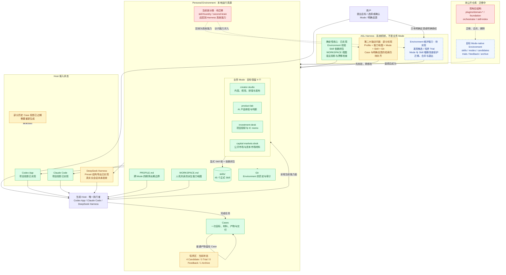
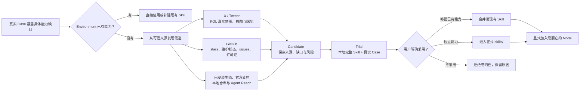

<p align="center">
  
</p>

<p align="center">
  <a href="https://github.com/qihangzhang-272/agent-skill-library/stargazers"></a>
  <a href="https://github.com/qihangzhang-272/asl-harness"></a>
  
  
  
</p>

<p align="center">
  一套被真实工作养出来、并且可以继续演化的个人 AI 工作环境。<br />
  Skill 提供能力，Mode 选择当前工作状态，Harness 负责让整个环境不跑偏。
</p>

---

## 这不是一堆 Skill

把 Skill 越装越多，最后通常会得到一个越来越难用的 Agent：写公众号时背着估值模板，做投研时加载排版规则，遇到能力缺口就在任务中途临时接一个 MCP。能力在增加，工作环境却越来越混乱。

ASL 想解决的是另一件事：把一个人长期使用 AI 的方法，维护成多个可以切换的 **Mode**。

- **Skill** 是一项完整的本地能力。
- **Mode** 是完成某类广域工作时需要的能力集合、边界与材料入口。
- **Case** 是一次具体任务及其输入、过程产物和交付。
- **Harness** 是系统机制：校验结构、维护能力地图、保护增删改查、生成宿主投影。
- **Host** 是唯一执行者：Codex App、Claude Code 或 DeepSeek Harness。

Mode 不是 Domain，也不是 Workflow。它不规定第一步做什么、第二步做什么；当前 Host 根据目标和材料，在 Mode 的能力面内动态选择完整 Skill。

## 两个仓库，一种 Environment

| 仓库 | 角色 |
| --- | --- |
| [asl-harness](https://github.com/qihangzhang-272/asl-harness) | 空白架构、确定性校验、能力地图和三宿主投影 |
| **agent-skill-library** | 已经筛选、调教并在真实 Case 中使用过的 Mode 与 Skill |

两者遵守同一种 Environment 结构。前者像一间刚交付的工作室，后者是已经工作了很久的工作室。Harness 不替 Agent 做业务，也不增加第二个调度器；它只守住工作环境的结构边界。

## 当前项目全景

> 状态快照：2026-08-30。绿色为已实现，黄色为部分实现，蓝色虚线为目标，红色为待迁移旧结构。



这张图刻意区分了三种东西：

1. **Harness 系统能力**始终存在，负责维护 Environment，不被用户当作业务 Mode 切换。
2. **业务 Mode**只描述当前要进入的广域工作状态，不拥有 Harness 的管理权限。
3. **普通 Case 内容**默认留在 Case；它不会因为出现过一次，就自动改写 Mode 或 Skill。

## Mode 的边界

当前目标只保留业务 Mode：

| Mode | 解决什么 | 不包含什么 |
| --- | --- | --- |
| `creator-studio` | 公众号、长内容、视觉、排版与发布 | 投研模型、资本市场材料 |
| `product-lab` | AI 产品体验、机制拆解与产品判断 | 内容发布链、估值链 |
| `investment-desk` | 私募项目研究、模型、估值、尽调与 IC memo | 公众号发布环境 |
| `capital-markets-desk` | 公开市场研究、公司覆盖和资本市场材料 | 私募项目的完整尽调环境 |

`skill-foundry` 和 `second-brain` 不应继续作为 Mode：

- 能力发现、Candidate、Trial、正式 Skill 的增删改查，是 Harness 自身的维护能力。
- 第二大脑不是一个房间，而是整个 Environment 的可读、可检索和可追溯能力。

创建一个新 Mode 的条件也不应该是一条任务变复杂了。只有当一种工作状态会反复出现、需要独立的能力边界，而且现有 Mode 无法清楚表达时，才由用户确认创建。

## Harness 与普通内容如何分开

| 层 | 可以改变什么 | 谁来决定 | 是否可被普通任务自动改写 |
| --- | --- | --- | --- |
| Harness 确定性核心 | 结构、引用、依赖、投影和安全边界 | CLI 按规则执行 | 否 |
| Harness 维护能力 | Candidate、Trial、Skill、Mode 和能力地图 | 当前 Host 起草，用户对关键变更授权，CLI 校验 | 否 |
| 业务 Mode | 当前工作状态可见的正式 Skill 与边界 | 用户与当前 Host | 否 |
| Skill | 一项完整本地能力及完成标准 | 当前 Host 在真实 Case 中培养 | 否 |
| Case | 本次目标、材料、运行产物和交付 | 当前 Host | 是，但只影响当前 Case |
| Feedback | 用户明确说出的修改意见 | 用户 | 只成为演化候选，不自动落库 |

点击、停留、沉默、重复修改和其他含义不明确的行为都不会被猜成偏好。只有用户明确反馈、明确采用或明确授权删除，才能触发 Environment 变更。

## Mode 与 Skill 的增删改查

Harness 不需要数据库式 CRUD API。文件和 Git 就是真源；CLI 负责在变更前后守住引用完整性。

| 对象 | 创建 | 更新 | 删除或退出 | 读取 |
| --- | --- | --- | --- | --- |
| Skill | 具体能力缺口 → Candidate → 完整 Trial → 真实 Case → 用户明确采用 | 复制到 Trial 修改，跑回归 Case，通过后替换正式 Skill | 检查 Skill 依赖和 Mode 引用；取得用户确认；移除活动引用后归档或删除 | 先读能力摘要，实际调用时读完整 Skill 包 |
| Mode | 反复出现的广域工作状态无法由现有 Mode 表达；用户确认 | 只做最小能力差异，重新计算闭包并投影 | 确认没有活动投影；取得用户确认；归档或删除 | 读取 Mode 边界、Skill 根和完整依赖闭包 |

外部 Prompt、MCP、Agent、API、脚本或开源仓库也不能绕开这条边界。它们先作为来源进入 Candidate，经过本地化和真实 Case，最后才能成为正式本地 Skill。任务中途不会临时裸接一个外部能力。

## CLI 应该硬到什么程度

现在的 Harness 已经会拒绝结构错误、缺失或循环依赖、路径逃逸、旧 Workflow 回流和宿主文件覆盖，但 Mode/Skill 维护门禁还没有完成。

目标原则是：**确定事实硬阻断，语义判断不硬编码。**

### 必须拒绝

- Skill 缺少合法名称、描述、完成标准或必需来源记录；
- Skill 依赖缺失或形成循环；
- Mode 引用 Candidate、Trial 或不存在的正式 Skill；
- 删除仍被其他 Skill 或 Mode 引用的正式 Skill；
- 删除或替换仍在活动投影中的 Mode；
- 目录、链接或投影越出当前 Environment / Project；
- 投影覆盖无法证明由 ASL 生成的用户文件；
- `.env`、密钥、缓存、Git 元数据或可重建依赖进入发行投影；
- 旧 `workspace.yaml`、固定 Workflow、Run 状态树或第二调度器重新进入活动 Environment。

### 只提醒

- `WORKSPACE.md` 能力地图过期；
- 当前宿主投影落后于 Environment；
- 上游能力出现新版本；
- Candidate 尚未跑 Trial；
- 两个 Skill 可能语义重合。

### 交给当前 Host 判断

- 是否真的需要新 Mode；
- 外部能力是否值得培养；
- 两个 Skill 应该合并还是并存；
- 当前 Case 应该组合哪些 Skill；
- 内容质量、业务判断和最终交付是否合格。

这样 Harness 会在能证明错误的地方足够硬，但不会因为一个 key 缺失、视图过期或系统无法理解语义，就阻断用户正常工作。

## 能力如何被发现和吸收

能力发现属于 Harness 维护能力，不属于某个业务 Mode，也不是一份巨型 Skill Index。



我们借鉴 [yichen-skills](https://github.com/mcncarl/yichen-skills) 对多来源搜索、个人选择和能力缝合的重视，但不会复制它的大型统一路由器、超长脚本和高耦合配置。KOL 推荐和 GitHub stars 负责帮助发现，完整阅读、来源检查和真实 Case 才决定是否进入本地 Environment。

## 目标目录

```text
agent-skill-library/
├── WORKSPACE.md                 # 自动生成的人机共读能力地图
├── PROFILE.md                   # 跨 Mode 的精简长期边界
├── skills/
│   └── <skill-id>/
│       ├── SKILL.md             # 完整能力与完成标准
│       ├── SOURCE.md            # 来源、版本、许可证和本地变化
│       ├── references/          # 按需读取
│       ├── scripts/             # 能力确实需要时才保留
│       └── assets/
├── modes/
│   └── <mode-id>/
│       ├── MODE.md              # 工作状态、边界和使用语义
│       └── mode.yaml            # 只保存显式 Skill 根
├── candidates/                  # 找到但尚未采用的能力
├── trials/                      # 已本地化、等待真实 Case 验证
├── feedback/                    # 只记录用户明确反馈
└── archive/                     # 退出活动面的历史材料
```

`WORKSPACE.md` 是从真源生成的可读视图，不是第二份手写 Skill Index。Skill 来源保存在各自的 `SOURCE.md`；Mode 只声明能力根，Harness 计算依赖闭包。

## 接入 Codex、Claude Code 与 DeepSeek Harness

同一份 Environment 通过投影进入宿主，不复制成三份业务真源：

| Host | 原生投影 | 当前状态 |
| --- | --- | --- |
| Codex App | `.agents/skills/` + `AGENTS.md` | 项目投影和校验已实现 |
| Claude Code | `.claude/skills/` + `CLAUDE.md` | 项目投影和校验已实现 |
| DeepSeek Harness | `.dsh/skills/` 或 Mode Agent Preset | 结构导出已实现，真实长会话待验收 |

```powershell
asl-harness workspace.validate --workspace C:\path\to\agent-skill-library

asl-harness host.project `
  --workspace C:\path\to\agent-skill-library `
  --project C:\path\to\current-project `
  --mode creator-studio `
  --host-id claude-code
```

宿主投影可以删除和重建；Environment 才是运行真源。当前 Host 仍然负责理解目标、选择 Skill 和完成任务，Harness 不接管它的 Agent 循环。

## 迁移状态

| 项目 | 当前状态 | 下一步 |
| --- | --- | --- |
| ASL Harness 核心 | 已实现 5 个确定性命令与 17 项测试 | 增加 Mode/Skill 维护前后校验，不增加第二调度器 |
| Personal Environment | 45 个正式 Skill、6 个 Mode 记录，校验通过 | 将 `skill-foundry`、`second-brain` 从 Mode 回收到 Harness 系统能力 |
| 本公开仓库 | 仍是 `plugins/domain-*`、`foundation`、`orchestrator`、`skill-index` 旧结构 | 迁移到唯一 `skills/` 与业务 `modes/`，再删除旧入口 |
| Codex / Claude 投影 | 新项目投影能力已实现 | 刷新仍使用旧格式的历史 Case |
| DeepSeek Harness | Preset 结构导出已实现 | 在真实 DSH 进程和长会话中验收 |
| 培养闭环 | Candidate 目录可识别 | 补齐 Trial、Feedback、引用完整性和退出门禁 |

在这些迁移完成前，不把公开仓库描述成已经完成的 Mode-native 成品，也不把目标能力冒充为当前 CLI 已实现功能。

## 设计底线

- 当前 Host 是唯一执行者，Harness 不成为第二个 Agent 或业务调度器。
- Skill 是最小完整能力单位，不再拆成运行时碎片。
- Mode 是广域工作状态，不是 Domain、固定 Workflow 或个人能力全集。
- Harness 系统机制与业务 Mode 分离；业务内容不能直接改写系统结构。
- 确定事实用 CLI 硬校验，语义判断留给当前 Host 和用户。
- 只记录用户明确反馈，不从含义不明的行为推断偏好。
- Candidate、Trial、正式 Skill、Mode、Case 和 Archive 不混用。
- 删除、合并和复用优先于新增字段、脚本、配置和隐藏层。
