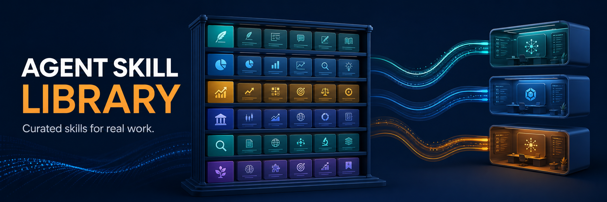
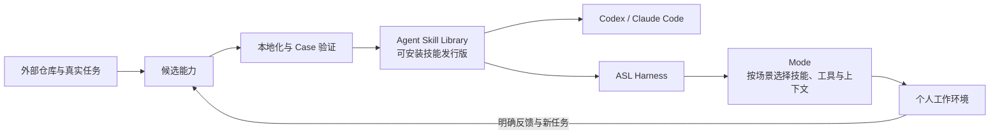

<p align="center">
  
</p>

<p align="center">
  <a href="https://github.com/qihangzhang-272/agent-skill-library/stargazers"></a>
  <a href="https://github.com/qihangzhang-272/agent-skill-library/actions/workflows/repository-gate.yml"></a>
  
  
</p>

<p align="center">
  一套经过真实任务筛选、可以直接安装的 Agent Skills。<br />
  写作、产品、投研与资本市场能力，共用同一份技能正文，同时进入 Codex 与 Claude Code。
</p>

---

## Agent Skill Library 是什么

模型会越来越强，但稳定完成一类工作，靠的仍然不只是临时提示词。研究方法、判断口径、交付格式、视觉规范和工具边界，需要被保存成可复用的能力。

Agent Skill Library 提供的就是这层能力：把经过真实 Case 验证的做法维护为本地 Skill，再按领域组成可安装的插件。安装以后，可以单独调用某个 Skill，也可以由宿主根据目标和当前上下文组合使用。

它是偏实用、带取舍的技能发行版。如果需要的是不包含个人技能的底层环境框架，请使用 [ASL Harness](https://github.com/qihangzhang-272/asl-harness)。

## 可以获得什么

| 能力包 | 适合处理 | 主要内容 |
| --- | --- | --- |
| `foundation` | 建造和维护技能 | Agent 操作原则、Skill 架构与演进约束 |
| `orchestrator` | 从目标进入现有能力 | 根据任务、材料与缺口选择技能；稳定的线性过程只保留为可选 chain |
| `skill-index` | 寻找外部能力 | 记录 GitHub 来源、许可证、调用方式和本地化边界 |
| `domain-writing` | 公众号与长内容生产 | 语料研究、选题、写作、排版、配图、HTML 与草稿箱交付 |
| `domain-product` | AI 产品分析 | 产品机制、用户价值、竞争判断与产品拆解 |
| `domain-investment` | 私募与项目投研 | 事实、模型、估值、尽调、IC memo 与可视化报告 |
| `domain-capital-markets` | 公开市场与投行材料 | 公司覆盖、图表、首次覆盖报告、Pitch Deck 与金融 QC |

正式 Skill 的正文都在 `plugins/<plugin>/skills/`。Claude Code 与 Codex 读取各自的插件元数据，但不会复制两套技能内容。

## 安装

### Claude Code

```powershell
claude plugin marketplace add qihangzhang-272/agent-skill-library
claude plugin install orchestrator@agent-skill-library
```

`orchestrator` 会按 Claude Plugin 的依赖声明带入相关能力。只需要某个领域时，也可以单独安装对应插件。

### Codex

```powershell
codex plugin marketplace add qihangzhang-272/agent-skill-library
```

随后在 Codex App 的 Plugins 页面安装需要的能力包。公众号生产通常安装 `domain-writing`；完整使用当前技能集合时，安装 marketplace 中的全部插件。安装或升级后新开任务，让宿主载入新的技能命名空间。

## 从技能库到个人工作环境

Skill 是能力，Mode 是一套工作的环境选择。两者不是同一个层级。



[ASL Harness](https://github.com/qihangzhang-272/asl-harness) 负责把本地 Skill 组织成可以持续演进的 Mode；本仓库负责提供已经筛选过的能力。一个 Mode 可以包含多个领域，也可以只加载完成当前场景真正需要的部分。固定 workflow 仍可存在，但只是 Mode 中的一种可复用路径，不是整个工作环境的骨架。

当前的迁移方向已经明确：技能正文继续由本仓库发行，个人环境由 Harness 维护 Mode。完整的开箱即用 Mode 包尚未作为本仓库的公开发行物发布，因此 README 不把这部分标记为已完成。

## 能力如何进入正式库

外部 MCP、Prompt、Agent、API 或开源 Skill，不会在运行途中直接变成隐式依赖。默认先进入来源索引；只有来源、许可证、能力边界和复用价值都清楚，并经过真实任务验证后，才本地化为正式 Skill。

```text
发现来源 → 记录 provenance → 本地化为 Candidate → Trial 跑真实 Case → 晋升为 Skill → 被 Mode 选用
```

这套边界让外部能力可以持续吸收，同时避免把整套第三方仓库、重复工具和短期实验一起塞进个人工作环境。运行产物写入当前项目，而不是写回技能库。

## 仓库结构

```text
agent-skill-library/
├── plugins/              # 技能正文与双宿主插件元数据
├── docs/                 # 治理规则和可复用工作说明
├── scripts/              # 仓库一致性校验
├── .claude-plugin/       # Claude Code marketplace
└── .agents/plugins/      # Codex marketplace
```

架构与收录边界见 [Library Constitution](docs/governance/library-constitution.md)，已有工作说明见 [Workflows](docs/workflows/)。

## 维护与验证

修改插件或 Skill 后，在仓库根目录运行：

```powershell
claude plugin validate . --strict
node scripts/validate-repository.mjs --base HEAD
```

校验会检查 Claude/Codex 双 manifest、两个 marketplace、版本一致性、技能发现、chain 引用和相对链接。仓库同时启用了 pre-push hook 与 GitHub Actions 门禁。

提交格式统一为：

```text
YYYY-MM-DD HH:mm｜中文变更描述
```

## 设计原则

- 技能正文只有一份；宿主适配只处理发现与分发。
- 外部来源先索引，再决定是否本地化，不把复制当成集成。
- Skill 是最小能力单位，不继续拆成大量运行时配置。
- Mode 面向完整工作环境，workflow 只保存真正稳定的路径。
- 真实 Case、明确反馈和可复现验证，决定一个能力是否值得长期保留。
