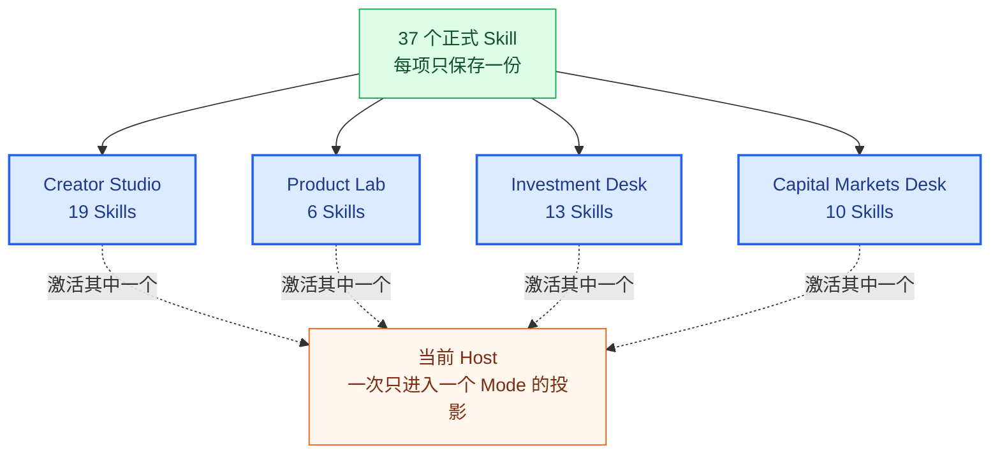

<p align="right">
  <strong>简体中文</strong> · <a href="README_EN.md">English</a>
</p>

<p align="center">
  
</p>

<h1 align="center">Agent Skill Library</h1>

<p align="center">
  <strong>一套可以直接 Fork、运行和继续培养的个人 AI 工作环境。</strong>
</p>

<p align="center">
  37 个本地 Skill，组织成 4 个相互隔离的工作 Mode，可投影到 Codex、Claude Code 与 DeepSeek Harness。
</p>

<p align="center">
  <a href="https://github.com/qihangzhang-272/agent-skill-library/stargazers"></a>
  <a href="https://github.com/qihangzhang-272/asl-harness"></a>
  
  
</p>

<p align="center">
  <a href="#quick-start">Quick Start</a> ·
  <a href="#whats-inside">What's Inside</a> ·
  <a href="#modes">Modes</a> ·
  <a href="#make-it-yours">Make It Yours</a> ·
  <a href="https://github.com/qihangzhang-272/asl-harness/blob/main/docs/asl-architecture-views.md">Architecture</a> ·
  <a href="https://github.com/qihangzhang-272/asl-harness">Blank Harness</a>
</p>

---

Agent Skills 让专业能力可以被封装和复用，但一个长期工作的 AI 环境还需要更多东西：技能从哪里来、哪些应该保留、不同场景该加载哪些能力、换一个 Agent 后怎样继续使用，以及真实反馈怎样沉淀成下一次工作的起点。

Agent Skill Library 是这些问题的一份可运行答案。它不是一个尽可能收录更多项目的 Skill 合集，而是一份已经按 [ASL Harness](https://github.com/qihangzhang-272/asl-harness) 组织好的参考 Environment：

- 正式 Skill 只保留一份本地真源；
- 每项外部能力都带有来源、版本和本地变化记录；
- Mode 把能力组织成不同工作场景，并在宿主投影中相互隔离；
- 当前 Agent 只看到当前 Mode 的 Skill 闭包；
- Git 保存所有长期变化，宿主投影随时可以重建；
- clone 或 Fork 以后，这份仓库就可以成为你自己的工作环境。

你可以直接使用现有 Mode，也可以把它当作一个已经长出真实内容的起点：删除不适合自己的能力，替换写作方式，加入新的研究工具，再把反复出现的工作培养成新的 Mode。

## Why This Repository Exists

大多数技能仓库优化的是“发现更多能力”。但真正使用一段时间以后，问题会从发现转向治理。

### 收藏不等于拥有

一个 GitHub Star、浏览器书签或全局安装，并不等于这项能力已经进入个人工作系统。它可能缺少来源记录，可能和已有 Skill 重合，也可能只在某个 Agent 中可用。

这份仓库把采用后的能力保存为完整本地 Skill。说明、参考资料、脚本、模板和运行依赖放在一起，Git 记录本地修改，`SOURCE.md` 记录它和上游的关系。

### 场景不应该依赖每次临时选择

技能数量增加后，让 Agent 每次从全部描述里重新判断，会产生不必要的召回负担。内容创作、产品分析、私募研究和公开市场研究需要不同的材料、语言、工具和质量标准。

ASL Mode 在宿主原生 Skill 发现之前先划定场景边界。一个 Mode 可以包含几十项能力，但它不需要知道另一个 Mode 里有什么。

### 个人环境应该能跨 Agent 迁移

模型和宿主会变化，个人积累不应该跟着重来。同一份 Environment 可以生成 Codex、Claude Code 和 DeepSeek Harness 的原生投影；宿主负责执行，仓库负责保存人的长期能力。

## Quick Start

### Install

```bash
git clone https://github.com/qihangzhang-272/asl-harness.git
git clone https://github.com/qihangzhang-272/agent-skill-library.git

python -m pip install -e ./asl-harness
```

### Inspect the Environment

```bash
asl-harness state \
  --workspace ./agent-skill-library

asl-harness workspace.validate \
  --workspace ./agent-skill-library
```

`state` 提供紧凑的能力概览；`workspace.validate` 检查 Skill、来源、依赖、Mode 和目录边界。

### Activate a Mode in Codex

```bash
asl-harness host.project \
  --workspace ./agent-skill-library \
  --project /path/to/current-project \
  --mode creator-studio \
  --host-id codex-app

asl-harness host.verify \
  --workspace ./agent-skill-library \
  --project /path/to/current-project \
  --mode creator-studio \
  --host-id codex-app
```

然后直接用 Codex 打开目标项目。它会在 `.agents/skills/` 中发现 Creator Studio 的完整 Skill 闭包，并从 `AGENTS.md` 读取当前 Mode 边界。

切换到 `claude-code` 或 `deepseek-harness` 时，不需要复制或改写这些 Skill，只需要生成对应宿主投影。

## What's Inside

当前仓库包含 37 个正式 Skill 和 4 个业务 Mode。Skill 数量与 Mode 能力面并不相加：一项通用研究、图表或估值能力可以被多个 Mode 显式选择，但活动真源始终只有一份。

| 能力组 | 代表能力 | 用来解决什么 |
| --- | --- | --- |
| 研究与素材 | 网络检索、已知内容归档、选题研究沉淀、公众号语料研究 | 从公开来源建立可复查的事实和素材基础 |
| 内容与编辑 | 公众号写作风格、Markdown 格式化、个人排版、HTML 转换 | 把研究转化为可读、可发布的长内容 |
| 视觉表达 | 封面、配图、漫画、信息图、架构图、图像生成与压缩 | 用视觉结构降低复杂内容的理解成本 |
| AI 产品分析 | 产品机制、商业模式、数据产品和叙事判断 | 理解 AI 产品是什么、为何成立以及值得关注什么 |
| 私募投研 | 市场、竞争、单位经济、评分、估值、尽调、IC memo | 从事实到投资委员会材料的完整专业能力面 |
| 公开市场 | 公司画像、财务模型、估值、覆盖报告、资本市场材料 | 支持上市公司和资本市场研究交付 |
| 发布与传播 | 微信公众号发布、X 内容卡片 | 将完成的内容转成目标渠道可用的产物 |

所有正式能力都位于 [`skills/`](skills/)。当前的人机共读目录见 [`WORKSPACE.md`](WORKSPACE.md)。

## Modes

Mode 是一种广域工作状态，不是 Domain 标签，也不是固定 Workflow。它决定当前 Host 可以发现哪些 Skill，不规定任务必须按照哪条顺序执行。



### Creator Studio

面向中文长内容和微信公众号工作。它把素材研究、AI 产品分析、作者表达、编辑、视觉叙事、配图、排版、HTML 和发布准备放进同一工作场，但不会同时加载估值、尽调和资本市场模板。

典型任务包括：

- 从一个产品、论文、访谈或行业变化形成长文；
- 收集公开材料并保留证据；
- 为文章设计封面、配图、漫画和信息图；
- 把 Markdown 组装为微信兼容 HTML；
- 在用户确认后进入公众号发布环节。

### Product Lab

面向 AI 产品体验和判断。它保留研究、归档、产品分析、架构图与信息图能力，但不默认加载完整内容发布链。

适合回答：

- 产品到底解决什么问题；
- 核心机制与传统方案有什么不同；
- 商业模式、数据和产品叙事是否自洽；
- 哪些变化具有产品意义，哪些只是功能更新；
- 怎样把复杂机制讲成清楚的图和判断。

### Investment Desk

面向私募项目研究和投资委员会材料。它覆盖事实、AI 产品判断、竞争格局、单位经济、评分、财务模型、估值、尽调、投资论点跟踪、IC memo、图表和视觉报告。

Mode 不把这些能力写成僵死顺序。材料完整时可以直接进入某项分析；事实不足时，当前 Agent 会回到研究能力补充证据。

### Capital Markets Desk

面向上市公司、公开市场和资本市场交付。它包括公司画像、财务模型、估值、公开市场覆盖报告、投行 Pitch Deck、M&A 材料、金融图表和最终文档质检。

公开市场与私募研究可以共享估值或论点跟踪能力，但不会通过隐式继承混入对方的全部工作场。

## Why Modes Work Better at Scale

Agent Skills 通常采用渐进式加载：宿主先读取名称和描述，匹配任务后再加载完整说明。这对少量 Skill 很有效；当一个人的能力库持续增长时，第一阶段的候选集合本身也会变得拥挤。

Mode 在它前面增加一层稳定、由人定义的场景收敛：

```text
Environment 中的全部 Skill
        ↓  Mode 选择当前工作场
当前 Mode 的 Skill 与依赖闭包
        ↓  Host 原生渐进式召回
当前任务真正需要的完整 Skill
```

这让 AI 不必在每次任务里重新理解一个人的全部职业与兴趣，也减少了相似 Skill、跨场景术语和无关质量规则对召回的干扰。

Mode 之间的隔离发生在宿主发现面：只有当前 Mode 的受管 Skill 会进入目标项目。它不是安全沙箱；文件、网络、MCP 和命令权限仍由宿主决定。

## Make It Yours

这四个 Mode 不是每个人都应该照搬的标准答案。它们展示的是一种组织方法：从真实工作出发，定义稳定场景，再让 Skill 围绕场景生长。

clone 或 Fork 以后，可以从下面几种修改开始。

### Remove What You Do Not Use

如果不做投资研究，可以删除对应 Mode，并在确认没有其他引用后删除相关 Skill。Harness 会检查依赖和活动投影，避免留下断裂引用。

### Change a Mode's Capability Surface

编辑 `modes/<mode-id>/mode.yaml` 中的 Skill 根，然后重新校验和投影。Mode 不需要列出依赖 Skill，Harness 会自动解析闭包。

```yaml
apiVersion: asl-wep/v0.3.0
kind: ModeProjection
metadata:
  id: creator-studio
spec:
  skills:
    - topic-research-deposition
    - public-account-writing-style
    - editorial-visual-storytelling
    - qihang-wechat-layout
```

### Add an External Skill

Skill 可以来自 GitHub、技能市场、公开推荐、官方资料或另一份 ASL Environment。值得长期使用的能力需要完整进入本地，而不是在任务中途成为一次性 Prompt。

从另一份 Environment 引入时先预览：

```bash
asl-harness environment.sync \
  --source /path/to/source-environment \
  --target ./agent-skill-library \
  --skill skill-id \
  --mode creator-studio \
  --check
```

确认后去掉 `--check`。真正采用上游文字、代码、脚本、模板或独特资产时保留作者和许可；只借鉴需求和组织逻辑时，基于本地契约与官方接口重新实现。

### Let Explicit Feedback Change the Environment

一次产物不好，通常只返工当前 Case。只有反馈揭示了稳定能力缺口，才修改 Skill；只有一类工作反复需要不同能力边界，才修改或新建 Mode。

ASL 不从点击、耗时、沉默或其他含义不明确的行为自动推断偏好。人的明确反馈才是长期演化信号。

## How Skills Are Maintained

### One Active Source

每个正式 Skill 只保存在 `skills/<skill-id>/`。多个 Mode 使用同一能力时，分别引用同一个 Skill，不复制目录。

### Provenance Travels with the Skill

`SOURCE.md` 保存来源仓库、原始版本、本地变化、采用方式和许可证信息。这样可以检查上游更新，也可以判断本地版本为何已经不同。

### Runtime Requirements Stay Local

需要 MCP、命令、环境变量或宿主插件时，责任 Skill 在自己的 `SKILL.md` 中说明检查方式和缺失处理。宿主已经具备的模型、工具、Agent、认证和沙箱不会被仓库再封装一层。

### Learning Areas Do Not Pollute Active Skills

- `candidates/` 保存尚未决定是否采用的能力线索；
- `trials/` 隔离安全、重合、运行方式或价值仍不确定的试验；
- `feedback/` 只保存用户明确表达的长期反馈；
- `archive/` 保存退出活动面的历史内容。

它们都不会被 Mode 当作正式能力投影给宿主。

## Host Support

| Host | Skill Projection | Mode Entry | Optional Stability Hook |
| --- | --- | --- | --- |
| Codex App | `.agents/skills/` | `AGENTS.md` | ASL Environment Host Plugin |
| Claude Code | `.claude/skills/` | `CLAUDE.md` | ASL Environment Host Plugin |
| DeepSeek Harness | `.dsh/skills/` | `AGENTS.md` / Agent Preset | Official Cordis Hook Bridge |

投影是可删除、可重建的宿主视图。真正需要登录的 MCP、API 或发布服务继续使用宿主原生配置，不会被提交到 Environment。

DeepSeek Agent Preset 从本机一份已经可以运行的 Preset 复制：

```bash
asl-harness deepseek.preset.export \
  --workspace ./agent-skill-library \
  --mode creator-studio \
  --base-preset /path/to/known-good-preset \
  --output /path/to/.dsh/.agent-presets/asl-creator-studio
```

ASL 替换 Mode 的 Persona 和 Skill 面，保留原有模型、插件、工具、存储和沙箱组合。

## Repository Layout

```text
agent-skill-library/
├── PROFILE.md             跨 Mode 的精简长期边界
├── WORKSPACE.md           自动生成的人机共读能力地图
├── skills/
│   └── <skill-id>/
│       ├── SKILL.md
│       ├── SOURCE.md
│       ├── scripts/
│       ├── references/
│       └── assets/
├── modes/
│   └── <mode-id>/
│       ├── MODE.md
│       └── mode.yaml
├── candidates/
├── trials/
├── feedback/
└── archive/
```

`WORKSPACE.md` 是从当前真源生成的能力地图，不是第二份手写 Skill Index。旧 Foundation、Orchestrator、Domain 插件和重复索引已经退出活动结构，只在 Archive 中保留必要追溯。

## Agent Skill Library and ASL Harness

| | [ASL Harness](https://github.com/qihangzhang-272/asl-harness) | Agent Skill Library |
| --- | --- | --- |
| 定位 | 创建和维护个人 Environment 的空白 Harness | 已装填、可以直接运行的参考 Environment |
| 内容 | CLI、约束、Host Adapter、Hook 和最小示例 | 37 个正式 Skill、4 个 Mode 与来源记录 |
| 使用方式 | 从零建立自己的能力库 | Fork 后先使用，再裁剪和培养 |
| 变化来源 | 协议、校验或宿主接入变化 | 真实 Case、外部能力与用户明确反馈 |

两者使用同一种 Environment Contract。Agent Skill Library 不是 ASL Harness 的兼容发行层，也不是远程注册中心；它只是一个已经长出内容的实例。

## FAQ

<details>
<summary><strong>必须使用仓库中的四个 Mode 吗？</strong></summary>

不需要。可以只保留一个，也可以建立完全不同的 Mode。Mode 应该对应你会反复进入的真实工作状态。

</details>

<details>
<summary><strong>为什么不把 37 个 Skill 全局安装？</strong></summary>

全局安装让所有能力同时进入宿主的发现候选。Mode 先根据场景收窄能力面，再让宿主做具体 Skill 召回，更适合长期增长的技能库。

</details>

<details>
<summary><strong>Mode 是一个自动调度器吗？</strong></summary>

不是。Mode 不执行任务，也不决定 Skill 顺序。当前 Codex、Claude Code 或 DeepSeek Harness 始终是唯一执行者。

</details>

<details>
<summary><strong>可以继续跟踪外部 Skill 更新吗？</strong></summary>

可以。来源和原始版本记录在 `SOURCE.md`。上游更新是候选变化，不会静默覆盖已经本地化的内容。

</details>

<details>
<summary><strong>这是一套固定的个人画像吗？</strong></summary>

不是。`PROFILE.md` 只保存跨 Mode 仍然需要成立的精简边界；具体工作习惯、质量标准和专业知识应留在相应 Skill 与 Mode 中。

</details>

## Documentation and Status

- [Current Capability Map](WORKSPACE.md)
- [ASL Harness](https://github.com/qihangzhang-272/asl-harness)
- [Full Architecture and Project Status](https://github.com/qihangzhang-272/asl-harness/blob/main/docs/asl-architecture-views.md)

当前 Environment 已通过结构、来源、依赖与 Mode 校验。动态数量、迁移状态和三宿主验收证据统一维护在 ASL 架构文档中，README 不复制第二份易过期状态。

## Sources and Licenses

每个来源 Skill 的作者、版本、本地变化和许可信息以对应 `SOURCE.md` 与 [`LICENSES/`](LICENSES/) 为准。使用或再分发具体 Skill 前，请检查该 Skill 的来源记录和上游许可证。
