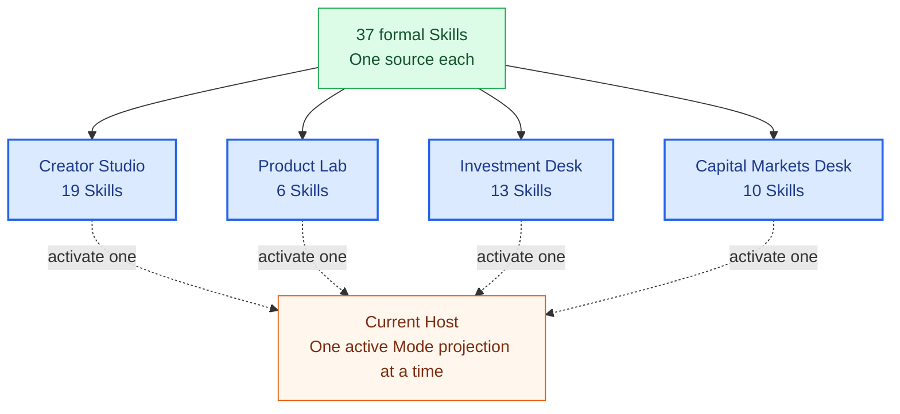

<p align="right">
  <a href="README.md">简体中文</a> · <strong>English</strong>
</p>

<p align="center">
  
</p>

<h1 align="center">Agent Skill Library</h1>

<p align="center">
  <strong>A personal AI work environment you can fork, run, and keep cultivating.</strong>
</p>

<p align="center">
  37 local Skills organized into 4 isolated work Modes, ready to project into Codex, Claude Code, and DeepSeek Harness.
</p>

<p align="center">
  <a href="https://github.com/qihangzhang-272/agent-skill-library/stargazers"></a>
  <a href="https://github.com/qihangzhang-272/asl-harness"></a>
  
  
</p>

<p align="center">
  <a href="#quick-start">Quick Start</a> ·
  <a href="#whats-inside">What's Inside</a> ·
  <a href="#modes">Modes</a> ·
  <a href="#make-it-yours">Make It Yours</a> ·
  <a href="https://github.com/qihangzhang-272/asl-harness/blob/main/docs/asl-architecture-views.md">Architecture</a> ·
  <a href="https://github.com/qihangzhang-272/asl-harness">Blank Harness</a>
</p>

---

Agent Skills make professional capabilities portable, but a durable AI work environment needs more: where each Skill came from, which ones should remain active, which capabilities belong to each work context, how the same environment moves across Agents, and how real feedback improves future work.

Agent Skill Library is a runnable answer to those questions. It is not a collection trying to include as many projects as possible. It is a reference [ASL Environment](https://github.com/qihangzhang-272/asl-harness) with real content already organized:

- each formal Skill has one local active source of truth;
- external capabilities carry provenance, version, and local-change records;
- Modes organize capabilities into distinct work contexts and isolate their Host projections;
- the current Agent sees only the active Mode's Skill closure;
- Git preserves every durable change, while Host projections remain rebuildable;
- after clone or fork, the repository can become your own work environment.

You can use the existing Modes immediately or treat them as a cultivated starting point: remove capabilities that do not fit, replace the writing style, add research tools, and turn recurring work into new Modes.

## Why This Repository Exists

Most Skill repositories optimize for discovering more capabilities. Long-term use shifts the problem from discovery to governance.

### Bookmarking is not ownership

A GitHub Star, browser bookmark, or global installation does not mean a capability has entered a personal work system. It may have no provenance record, overlap with an existing Skill, or work in only one Agent.

This repository keeps adopted capabilities as complete local Skills. Instructions, references, scripts, templates, and runtime requirements stay together. Git records local changes, while `SOURCE.md` explains the relationship to upstream.

### Context should not be re-created before every task

As the collection grows, asking an Agent to reconsider every Skill description on every task creates unnecessary recall pressure. Content creation, product analysis, private-market research, and public-market research use different materials, language, tools, and quality standards.

An ASL Mode narrows the context before native Skill discovery. A Mode may contain many capabilities, but it does not need to know what belongs to another Mode.

### A personal environment should survive a change of Agent

Models and Hosts change. Personal capabilities should not have to start over. The same Environment can generate native projections for Codex, Claude Code, and DeepSeek Harness. The Host executes the work; the repository preserves what the person has learned.

## Quick Start

### Install

```bash
git clone https://github.com/qihangzhang-272/asl-harness.git
git clone https://github.com/qihangzhang-272/agent-skill-library.git

python -m pip install -e ./asl-harness
```

### Inspect the Environment

```bash
asl-harness state \
  --workspace ./agent-skill-library

asl-harness workspace.validate \
  --workspace ./agent-skill-library
```

`state` returns a compact capability overview. `workspace.validate` checks Skills, provenance, dependencies, Modes, and directory boundaries.

### Activate a Mode in Codex

```bash
asl-harness host.project \
  --workspace ./agent-skill-library \
  --project /path/to/current-project \
  --mode creator-studio \
  --host-id codex-app

asl-harness host.verify \
  --workspace ./agent-skill-library \
  --project /path/to/current-project \
  --mode creator-studio \
  --host-id codex-app
```

Open the target project in Codex. It discovers the Creator Studio Skill closure under `.agents/skills/` and reads the active Mode boundary from `AGENTS.md`.

Changing `host-id` to `claude-code` or `deepseek-harness` generates the corresponding projection without copying or rewriting the formal Skills.

## What's Inside

The repository currently contains 37 formal Skills and 4 business Modes. Mode counts overlap: a general research, charting, or valuation capability may be selected by several Modes, while its active source remains unique.

| Capability group | Representative capabilities | Purpose |
| --- | --- | --- |
| Research and source material | web research, known-content archiving, topic deposition, public-account corpus research | Build a reviewable fact and material base from public sources |
| Writing and editing | public-account writing, Markdown formatting, personal typography, HTML conversion | Turn research into readable, publishable long-form content |
| Visual communication | covers, illustrations, comics, infographics, architecture diagrams, image generation and compression | Reduce the cognitive load of complex ideas through visual structure |
| AI product analysis | mechanism, business model, data-product, and narrative analysis | Explain what an AI product is, why it may work, and what matters |
| Private-market investing | market, competition, unit economics, scorecards, valuation, DD, IC memos | Provide a complete professional surface from facts to committee material |
| Public markets | company profiles, financial models, valuation, coverage, capital-markets deliverables | Support listed-company and capital-markets research |
| Publishing and distribution | WeChat publishing and X content cards | Convert finished content into channel-ready artifacts |

All formal capabilities live under [`skills/`](skills/). The current human- and Agent-readable catalog is [`WORKSPACE.md`](WORKSPACE.md).

## Modes

A Mode is a broad working state, not a Domain label or fixed Workflow. It changes what the current Host can discover without dictating the order of execution.



### Creator Studio

Built for Chinese long-form content and WeChat public-account work. It brings research, AI product analysis, author voice, editing, visual storytelling, illustration, typography, HTML, and publishing preparation into one context without also loading valuation, diligence, and capital-markets templates.

Typical work includes:

- turning a product, paper, interview, or industry change into a long-form article;
- collecting public material with reviewable evidence;
- designing covers, illustrations, comics, and infographics;
- assembling Markdown into WeChat-compatible HTML;
- entering the publishing stage after user confirmation.

### Product Lab

Built for AI product experience and judgment. It retains research, archiving, product analysis, architecture-diagram, and infographic capabilities without loading the complete publishing chain by default.

It is designed to answer:

- What problem does the product actually solve?
- How does its mechanism differ from the previous approach?
- Are its business model, data, and product narrative coherent?
- Which changes have product significance, and which are merely feature updates?
- How can a complex mechanism be turned into a clear diagram and judgment?

### Investment Desk

Built for private-market research and investment-committee work. It covers facts, AI product judgment, competitive landscape, unit economics, scoring, financial models, valuation, diligence, thesis tracking, IC memos, charts, and visual reports.

The Mode does not hard-code these capabilities into a fixed order. Complete material can enter the relevant analysis directly; missing facts send the current Agent back to research.

### Capital Markets Desk

Built for listed companies, public markets, and capital-markets deliverables. It includes company profiles, financial models, valuation, public-equity coverage, pitch decks, M&A materials, financial charts, and final document quality control.

Public- and private-market Modes may share valuation or thesis-tracking Skills, but they never inherit each other's full capability surface implicitly.

## Why Modes Work Better at Scale

Agent Skills typically use progressive disclosure: a Host reads names and descriptions first, then loads full instructions after matching the task. This works well with a small collection. As a personal library grows, the first-stage candidate set itself becomes crowded.

Mode adds a durable, human-defined context boundary before native disclosure:

```text
All Skills in the Environment
        ↓  Mode selects the active work context
The active Mode's Skills and dependency closure
        ↓  Native Host progressive recall
The complete Skill needed by the current task
```

The Agent no longer needs to reconstruct the person's full set of professions and interests before every task, and similar Skills, cross-context terminology, and unrelated quality rules are less likely to interfere with recall.

Isolation occurs at the Host discovery surface: only ASL-managed Skills from the active Mode enter the target project. It is not a security sandbox; file, network, MCP, and command permissions remain the Host's responsibility.

## Make It Yours

The four Modes are not a universal answer. They demonstrate a method: start with real recurring work, define stable contexts, and allow Skills to grow around those contexts.

### Remove What You Do Not Use

If you do not perform investment research, remove the Mode and, after confirming no remaining references, remove its Skills. Harness validates dependencies and active projections to prevent broken references.

### Change a Mode's Capability Surface

Edit the Skill roots in `modes/<mode-id>/mode.yaml`, then validate and re-project. You do not need to list dependency Skills; Harness resolves the closure.

```yaml
apiVersion: asl-wep/v0.3.0
kind: ModeProjection
metadata:
  id: creator-studio
spec:
  skills:
    - topic-research-deposition
    - public-account-writing-style
    - editorial-visual-storytelling
    - qihang-wechat-layout
```

### Add an External Skill

Skills may come from GitHub, a marketplace, public recommendations, official sources, or another ASL Environment. Capabilities worth keeping enter the local Environment as complete Skills instead of one-off prompts injected mid-task.

Preview an import from another Environment:

```bash
asl-harness environment.sync \
  --source /path/to/source-environment \
  --target ./agent-skill-library \
  --skill skill-id \
  --mode creator-studio \
  --check
```

Remove `--check` after review. If upstream text, code, scripts, templates, or distinctive assets are adopted, retain the author and license. If only the requirement and organization idea are borrowed, implement against local contracts and official interfaces.

### Let Explicit Feedback Change the Environment

A poor artifact usually means reworking the current Case. Change a Skill only when feedback reveals a durable capability gap, and change or create a Mode only when recurring work needs a different capability boundary.

ASL does not infer preferences from clicks, duration, silence, or other ambiguous behavior. Explicit human feedback is the signal for durable evolution.

## How Skills Are Maintained

### One Active Source

Each formal Skill lives once under `skills/<skill-id>/`. When several Modes use it, each explicitly selects the same source instead of copying its directory.

### Provenance Travels with the Skill

`SOURCE.md` records the upstream repository, original version, local changes, adoption method, and license. Upstream updates can be reviewed without silently overwriting local work.

### Runtime Requirements Stay Local

When a Skill needs an MCP server, command, environment variable, or Host plugin, its own `SKILL.md` explains the check and missing-dependency behavior. Models, tools, Agents, authentication, and sandboxes already supplied by the Host are not wrapped again.

### Learning Areas Do Not Pollute Active Skills

- `candidates/` stores capability sources not yet selected for adoption;
- `trials/` isolates experiments with unresolved security, overlap, runtime, or value questions;
- `feedback/` stores explicit user feedback with potential long-term impact;
- `archive/` preserves content that has left the active surface.

None of these areas is projected to a Host as formal Mode capability.

## Host Support

| Host | Skill Projection | Mode Entry | Optional Stability Hook |
| --- | --- | --- | --- |
| Codex App | `.agents/skills/` | `AGENTS.md` | ASL Environment Host Plugin |
| Claude Code | `.claude/skills/` | `CLAUDE.md` | ASL Environment Host Plugin |
| DeepSeek Harness | `.dsh/skills/` | `AGENTS.md` / Agent Preset | Official Cordis Hook Bridge |

Projections are rebuildable Host views. MCP servers, APIs, and publishing services that require authentication continue to use native Host configuration and are never committed to the Environment.

A DeepSeek Agent Preset is exported from a local Preset already known to run:

```bash
asl-harness deepseek.preset.export \
  --workspace ./agent-skill-library \
  --mode creator-studio \
  --base-preset /path/to/known-good-preset \
  --output /path/to/.dsh/.agent-presets/asl-creator-studio
```

ASL replaces the Mode Persona and Skill surface while preserving the base model, plugins, tools, storage, and sandbox combination.

## Repository Layout

```text
agent-skill-library/
├── PROFILE.md             Concise boundaries shared across Modes
├── WORKSPACE.md           Generated human- and Agent-readable capability map
├── skills/
│   └── <skill-id>/
│       ├── SKILL.md
│       ├── SOURCE.md
│       ├── scripts/
│       ├── references/
│       └── assets/
├── modes/
│   └── <mode-id>/
│       ├── MODE.md
│       └── mode.yaml
├── candidates/
├── trials/
├── feedback/
└── archive/
```

`WORKSPACE.md` is generated from the active source of truth and is not a second hand-maintained Skill Index. The old Foundation, Orchestrator, Domain plugins, and duplicate indexes have left the active structure and remain only where historical traceability is necessary.

## Agent Skill Library and ASL Harness

| | [ASL Harness](https://github.com/qihangzhang-272/asl-harness) | Agent Skill Library |
| --- | --- | --- |
| Purpose | Blank Harness for creating and maintaining personal Environments | Filled reference Environment that can run immediately |
| Includes | CLI, constraints, Host Adapters, Hooks, and minimal examples | 37 formal Skills, 4 Modes, and provenance records |
| How to start | Build the capability library from scratch | Fork, run, then prune and cultivate |
| What drives change | Protocol, validation, or Host integration changes | Real Cases, external capabilities, and explicit user feedback |

They use the same Environment Contract. Agent Skill Library is neither a compatibility distribution nor a remote registry; it is simply an ASL instance with cultivated content.

## FAQ

<details>
<summary><strong>Do I have to use all four Modes?</strong></summary>

No. Keep one, remove three, or create entirely different Modes. A Mode should correspond to a real working state you expect to enter repeatedly.

</details>

<details>
<summary><strong>Why not install all 37 Skills globally?</strong></summary>

A global installation makes every capability a discovery candidate. A Mode narrows the capability surface by context before the Host performs specific Skill recall, which scales better for a growing personal library.

</details>

<details>
<summary><strong>Is a Mode an automatic scheduler?</strong></summary>

No. A Mode does not execute tasks or determine Skill order. Codex, Claude Code, or DeepSeek Harness remains the only executor.

</details>

<details>
<summary><strong>Can upstream Skill updates still be tracked?</strong></summary>

Yes. Provenance and original versions live in `SOURCE.md`. An upstream update is a candidate change and never silently overwrites localized content.

</details>

<details>
<summary><strong>Is this a fixed personal profile?</strong></summary>

No. `PROFILE.md` contains only concise boundaries that must remain true across Modes. Context-specific habits, quality standards, and expertise belong in the relevant Skills and Modes.

</details>

## Documentation and Status

- [Current Capability Map](WORKSPACE.md)
- [ASL Harness](https://github.com/qihangzhang-272/asl-harness)
- [Full Architecture and Project Status](https://github.com/qihangzhang-272/asl-harness/blob/main/docs/asl-architecture-views.md)

The current Environment passes structural, provenance, dependency, and Mode validation. Dynamic migration status and three-Host acceptance evidence are maintained in the ASL architecture document so the README does not become a second stale status surface.

## Sources and Licenses

The author, version, local changes, and license of each sourced Skill are recorded in its `SOURCE.md` and in [`LICENSES/`](LICENSES/) where applicable. Check the corresponding provenance record and upstream license before using or redistributing a specific Skill.
