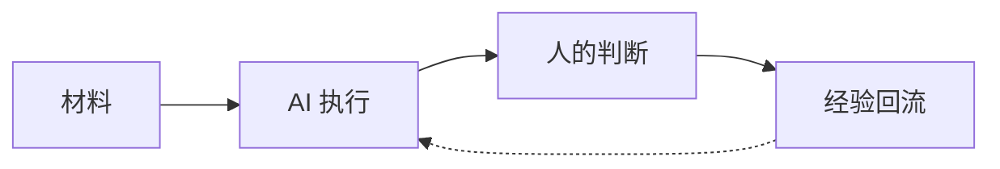

# Simple Editorial Diagram

## Purpose

Create a diagram that a public-account reader can understand on a phone without studying a legend.

## Modeling

1. Write the question above the source file.
2. Select one view:
   - actors and main relationship;
   - stages and main direction;
   - states and transitions;
   - decision and outcomes.
3. Keep 3–5 primary nodes. Split above 6.
4. Use no more than two subgraphs.
5. Use one solid main relation; add one dashed feedback relation only when feedback is the article’s point.
6. Put explanations in the caption, not inside nodes.

## Mermaid Source

Use `flowchart LR` or `flowchart TD` for most WeChat diagrams. Prefer descriptive IDs and short Chinese labels.

Do not use empty spacer nodes, invisible edges, or large amounts of manual positioning to fight the layout engine. If the source needs them, the view is probably too complex.

## Theme

- Background: `#F7F2E8`
- Foreground: `#101827`
- Surface: `#FFFDFC`
- Border: `#CDD4DF`
- Accent: `#2447D8`
- Muted: `#667085`
- Optional human-decision accent: `#E98A3A`

The palette may inherit an author’s brand, but geometry remains clean. Do not add paper noise, doodle arrows, hand-written fonts, shadows, gradients, icons, legends, or decorative grids by default.

## Validation

- Can the diagram be described in one sentence?
- Can every node label be read at mobile width?
- Does every connector have an unambiguous direction?
- Could one node be removed without losing the answer? If yes, remove it.
- Does the diagram preserve source/model files instead of only the exported bitmap?

